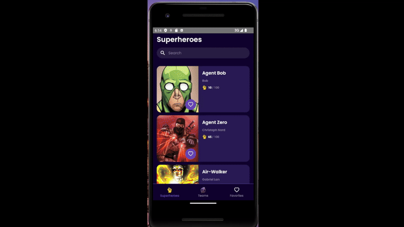

# Superheroes App

App movil en React Native



---


# Como ejecutarlo (Android, npm)

## Requisitos
- **Node.js 18+** y **npm**
- **Android Studio** (SDK + Platform Tools)
- **Java 17**
- Un **emulador AVD** iniciado desde Android Studio **o** un telefono fisico con *USB debugging*

Abrir Android Studio e iniciar un AVD antes de correr los comandos.

---

## Instalación
```bash
npm install
```

---

## Ejecución

1) **Iniciar Metro** en una terminal:
```bash
npm start
```
2) **Compilar e instalar** en otra terminal:
```bash
npm run android
```
3) La app se abrira en el emulador/dispositivo conectado.

---

## Comandos utiles

- **Reset de cache de Metro**:
```bash
npm start -- --reset-cache
```
- **Rebuild limpio (para Android)**:
```bash
cd android && ./gradlew clean && cd .. && npm run android
```
- **Cambiar de dispositivo**: asegurarse de tener un AVD encendido en Android Studio o conectar un telefono antes de `npm run android`.


---

## Estructura
```
src/
  api/           # fetch/cache de heroes
  components/    # HeroCard, MiniHeroCard, SearchBar
  screens/       # Home, Favorites, Teams, HeroDetail
  storage/       # favoritoss y equipos (persistencia local)
  utils/         # heroSearch, heroStats (Avg. Score)
  navigation/    # Tabs + Stack
  theme/         # colors, typography
```

---


## Respuestas

### 1) ¿Qué pasos deberá tomar en el futuro si la cantidad de superhéroes aumenta?

- Podria implementar paginacion para renderizar cierta cantidad de heroes a la vez asi no se sobrecarga lo que solicita la app en recursos y podria investigar si se puede hacer algun tipo de parelización al renderizado de tarjetas.

### 2)  ¿Qué podría modificar si se reciben reportes de usuarios que perciben que la app es muy lenta?

- Podria agregar settings que puedan ser ajustables como renderizar menos tarjetas de heroes, bajar la calidad de las imagenes similar a lo que hacen los juegos de computadora para obtener un mejor rendimiento segun las capacidades de cada dispositivo. 

---


